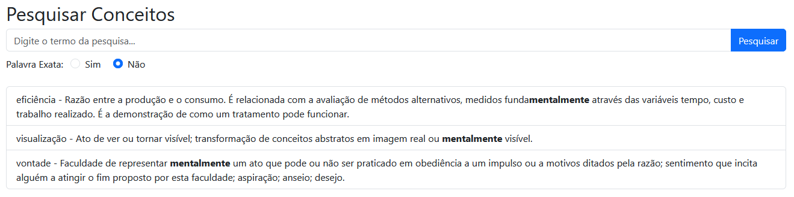

# TPC6
## Criação de Rota para Pesquisa de Termos
### Objetivo
Criar uma rota em Flask que permita ao utilizador pesquisar termos num dicionário médico. O template associado deve
listar os resultados encontrados, e cada um destes deve permitir a navegação para a página do conceito relacionado.

### Template HTML
O template desenvolvido herda o conteúdo do ``layout.html`` já existente e oferece um formulário para a realização de
uma pesquisa. É possível pesquisar palavras que **correspondam exatamente** aos termos procurados ou encontrar
**correspondências parciais** em qualquer secção de texto dos elementos do dicionário. Os resultados são renderizados
após a submissão do formulário sob a forma de lista não ordenada, cujos elementos permitem a navegação para o template
``conceito/<designacao>`` associado ao respetivo resultado.

**Nota**: As pesquisas realizadas são sempre **case-sensitive**.

### Rota em Flask
A rota criada suporta dois tipos de pedidos ``GET``:
1. **Acesso ao template sem parâmetros**, apresentando apenas o formulário de pesquisa.
2. **Acesso ao template com parâmetros de pesquisa**, onde os resultados são processados e apresentados.

Para a pesquisa e formatação dos resultados, utiliza-se:
- ``re.search`` para identificar correspondências no dicionário.
- ``re.sub`` para envolver os termos encontrados na tag ``<strong>``, garantindo o destaque no template.

Isto assegura uma pesquisa eficiente e uma apresentação intuitiva dos resultados ao utilizador.

Exemplo de pesquisa por correspondências parciais do termo "mentalmente":

