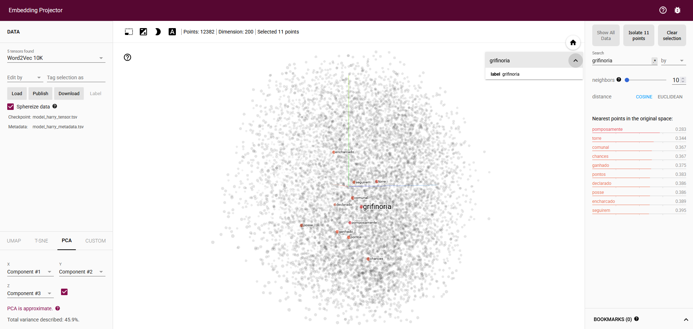

# TPC8  
## Criação de Word Embeddings com Word2Vec

### Objetivo  
Desenvolver *word embeddings* a partir de dois documentos da saga *Harry Potter*, recorrendo ao modelo **Word2Vec** da
biblioteca `gensim`. O objetivo é explorar relações semânticas entre palavras e identificar padrões textuais,
complementando a análise com visualizações gráficas (via **PCA** e **TensorFlow Embedding Projector**).

### Leitura dos Dados e Pré-Processamento  
Antes do treino do modelo, o texto foi sujeito a pré-processamento: desacentuação, conversão para lowercase e
tokenização. Foram testadas abordagens com e sem *stop words*, sendo os resultados apresentados referentes à versão sem
*stop words*.

O modelo foi inicialmente treinado com o **primeiro livro**, tendo depois o **segundo livro** sido usado para
**enriquecer o vocabulário** com termos novos não presentes no primeiro. Esta abordagem permite analisar como o modelo
se adapta à introdução de novo contexto sem perder o que já foi aprendido.

### Treino do Modelo Word2Vec  
O modelo foi treinado com os seguintes hiperparâmetros, escolhidos para equilibrar desempenho e tempo de treino:
```python
model = Word2Vec(sents, vector_size=200, window=5, min_count=1, sg=1, epochs=20, workers=3, seed=13) 
```
A utilização de uma *seed* fixa garante reprodutibilidade e permite avaliar o impacto de mudanças nos hiperparâmetros no
desempenho do modelo.

### Análise Semântica  
Para explorar os *embeddings*, usaram-se funções como `doesnt_match`, `similarity` e `most_similar`. Verificaram-se
agrupamentos coerentes, como entre os termos **"grifinoria", "lufa" e "sonserina"** — palavras que no contexto do
documento representam entidades semelhantes (casas de Hogwarts). A visualização com PCA reforçou estas observações ao
revelar agrupamentos gráficos semelhantes.

No entanto, nem todas as relações foram tão evidentes, o que poderá dever-se a:
- Tamanho limitado do corpus (apenas dois documentos);
- Possível inclusão de ruído no vocabulário (`min_count=1`);
- Dimensão dos vetores que, apesar de equilibrada, pode não ser suficiente para capturar todas as nuances;
- Número de épocas possivelmente insuficiente para estabilizar o modelo;
- Contexto limitado ou demasiado alargado (`window=5`) que poderá ser ajustado para captar relações mais distantes ou
focar apenas nas mais próximas.

### Salvamento dos Modelos  
O modelo foi guardado em diferentes formatos para facilitar a sua reutilização. Para visualização no
[TensorFlow Embedding Projector](https://projector.tensorflow.org/), foi usada a seguinte conversão:
```bash
python -m gensim.scripts.word2vec2tensor -i model_harry.txt -o model_harry
```

### Visualização com Embedding Projector  
A imagem abaixo mostra a relação da palavra "grifinoria" com termos como "pontos" ou "torre", que estão associados no
contexto dos documentos analisados. Esta ferramenta permite explorar de forma interativa os *embeddings*, complementando
o *scatter plot* gerado no notebook.


